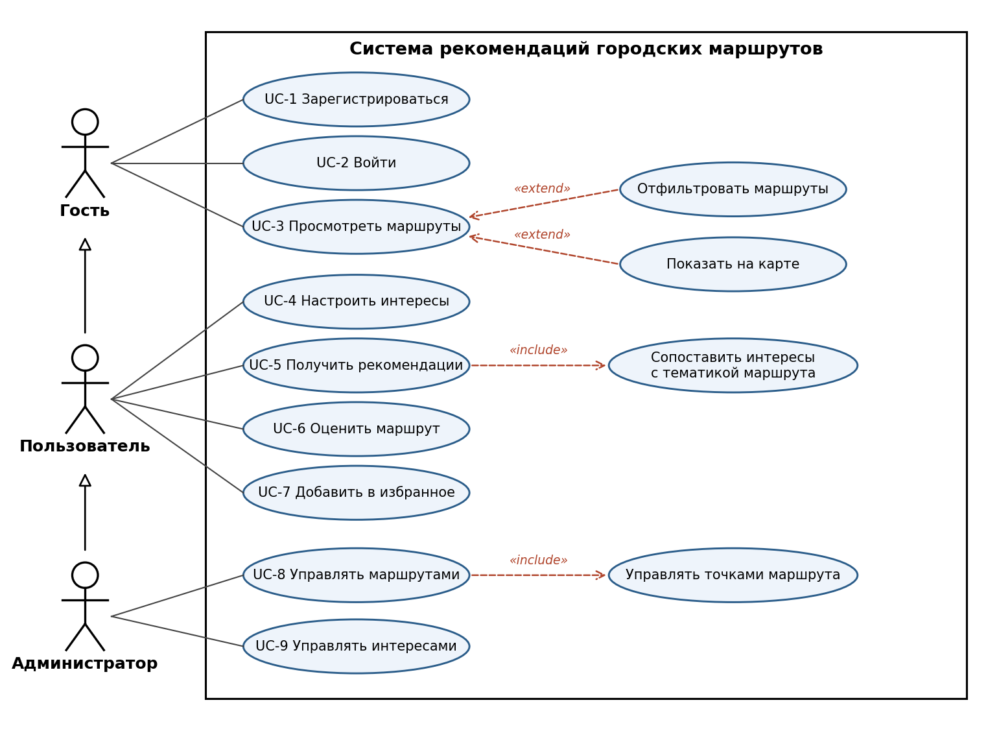
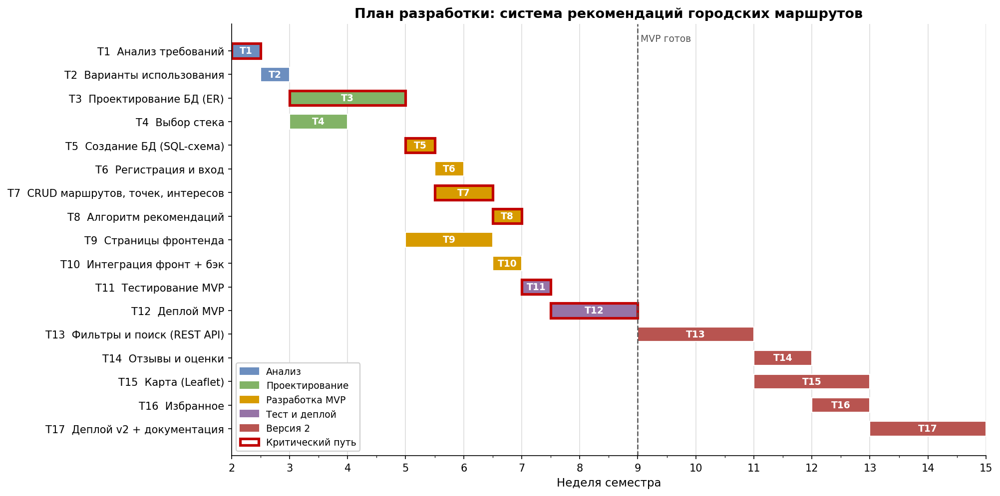

# Практическое занятие №2. Анализ требований и планирование

**Проект:** Система рекомендаций городских маршрутов
**Студент:** Ватаншоев Артур Бахтоваршоевич, ЭФБО-08-24

---

## 1. Основы веб-разработки

Приложение построено по клиент-серверной архитектуре:

```
Браузер (HTML/CSS/JS)  --HTTP-запрос-->  Веб-сервер (Python)  --SQL-->  База данных
                       <--HTML/JSON-----                      <--------
```

- **HTML** — структура страницы, **CSS** — оформление, **JavaScript** — интерактивность на стороне клиента.
- **Клиент** (браузер) отправляет HTTP-запрос (`GET /routes`, `POST /login`).
- **Сервер** обрабатывает запрос, обращается к БД и возвращает HTML-страницу или JSON.
- **Монолит** — фронтенд, бизнес-логика и доступ к данным находятся в одном приложении и разворачиваются вместе.

## 2. Анализ требований

**Методы сбора требований:** анализ аналогов (Яндекс Карты, izi.TRAVEL, Komoot), моделирование сценариев использования, мозговой штурм.
**Приоритизация:** метод MoSCoW (Must / Should / Could / Won't).

### 2.1. Роли пользователей

| Роль | Описание |
|---|---|
| Гость | Не авторизован, может просматривать маршруты |
| Пользователь | Зарегистрирован, указывает интересы, получает рекомендации, оставляет отзывы |
| Администратор | Управляет маршрутами, точками и справочником интересов |

### 2.2. Функциональные требования

| № | Требование | Роль | Приоритет |
|---|---|---|---|
| ФТ-1 | Регистрация и вход по e-mail и паролю | Гость | Must |
| ФТ-2 | Выбор и изменение своих интересов в профиле | Пользователь | Must |
| ФТ-3 | Просмотр списка маршрутов и карточки маршрута | Все | Must |
| ФТ-4 | Создание, редактирование, удаление маршрутов (CRUD) | Админ | Must |
| ФТ-5 | Добавление точек в маршрут и задание их порядка | Админ | Must |
| ФТ-6 | Подбор рекомендаций по совпадению интересов | Пользователь | Must |
| ФТ-7 | Фильтрация по тематике, длине, длительности | Все | Should |
| ФТ-8 | Оценка (1–5) и отзыв о маршруте | Пользователь | Should |
| ФТ-9 | Сохранение маршрутов в «избранное» | Пользователь | Could |
| ФТ-10 | Отображение маршрута на карте | Все | Could |

### 2.3. Нефункциональные требования

| № | Категория | Требование |
|---|---|---|
| НФТ-1 | Производительность | Формирование рекомендаций — не более 1 с |
| НФТ-2 | Нагрузка | До 100 одновременных пользователей |
| НФТ-3 | Безопасность | Пароли хранятся только в виде хеша (bcrypt), авторизация по токену |
| НФТ-4 | Надёжность | Ежедневное резервное копирование БД |
| НФТ-5 | Удобство | Русскоязычный интерфейс, адаптивная вёрстка под мобильные устройства |
| НФТ-6 | Совместимость | Актуальные версии Chrome, Firefox, Safari |
| НФТ-7 | Сопровождаемость | Код в Git, модульная структура |

### 2.4. Типичные ошибки при анализе требований

- размытые формулировки без измеримых критериев («система должна быть быстрой»);
- пропуск нефункциональных требований;
- противоречивые требования;
- добавление лишних функций, не нужных пользователю.

## 3. Варианты использования



- **Обобщение** (стрелка с треугольником): Пользователь наследует возможности Гостя, Администратор — Пользователя.
- **«include»** — обязательная часть варианта использования (выполняется всегда).
- **«extend»** — необязательное расширение (выполняется при определённом условии).

### UC-1. Зарегистрироваться

- **Актёр:** Гость
- **Предусловие:** у пользователя нет аккаунта.
- **Основной поток:**
  1. Гость открывает форму регистрации.
  2. Вводит имя, e-mail, пароль.
  3. Система проверяет, что e-mail не занят и пароль не короче 8 символов.
  4. Система сохраняет пользователя (пароль — в виде хеша).
  5. Система перенаправляет на выбор интересов.
- **Альтернативный поток:** 3а. E-mail занят — система выводит ошибку, возврат к шагу 2.
- **Результат:** создан новый пользователь.

### UC-5. Получить рекомендации

- **Актёр:** Пользователь
- **Предусловие:** пользователь авторизован.
- **Основной поток:**
  1. Пользователь открывает раздел «Рекомендации».
  2. Система получает интересы пользователя.
  3. Система сопоставляет интересы с тематиками маршрутов («include»).
  4. Система рассчитывает коэффициент соответствия для каждого маршрута.
  5. Система выводит маршруты по убыванию коэффициента.
- **Альтернативные потоки:**
  - 2а. Интересы не выбраны — система предлагает выбрать их (переход к UC-4).
  - 4а. Совпадений нет — система показывает популярные маршруты.
- **Результат:** пользователь видит список подходящих маршрутов.

### UC-8. Управлять маршрутами

- **Актёр:** Администратор
- **Предусловие:** вход выполнен с правами администратора.
- **Основной поток:**
  1. Администратор открывает панель маршрутов.
  2. Создаёт маршрут: название, описание, тематики, длина.
  3. Добавляет точки и задаёт их порядок («include»).
  4. Система проверяет, что точек не меньше двух и длина больше 0.
  5. Маршрут публикуется.
- **Альтернативный поток:** 4а. Данные некорректны — система подсвечивает ошибки.
- **Результат:** маршрут доступен пользователям.

## 4. План разработки

**Этапы:** анализ → проектирование → разработка → тестирование → развёртывание → развитие.
В MVP входят требования приоритета **Must**, во вторую версию — **Should** и **Could**.



| № | Задача | Недели | Зависит от | Требования |
|---|---|---|---|---|
| T1 | Анализ требований | 2 | — | — |
| T2 | Варианты использования | 2 | T1 | — |
| T3 | Проектирование БД (ER) | 3–4 | T1 | — |
| T4 | Выбор стека | 3 | T1 | — |
| T5 | Создание БД (SQL-схема) | 5 | T3, T4 | — |
| T6 | Регистрация и вход | 5 | T5 | ФТ-1 |
| T7 | CRUD маршрутов, точек, интересов | 5–6 | T5 | ФТ-2–5 |
| T8 | Алгоритм рекомендаций | 6 | T7 | ФТ-6 |
| T9 | Страницы фронтенда | 5–6 | T2, T4 | ФТ-3 |
| T10 | Интеграция фронтенда и бэкенда | 6 | T6, T7, T9 | — |
| T11 | Тестирование MVP | 7 | T8, T10 | — |
| T12 | Деплой MVP | 7–8 | T11 | — |
| T13 | Фильтры и поиск (REST API) | 9–10 | T12 | ФТ-7 |
| T14 | Отзывы и оценки | 11 | T13 | ФТ-8 |
| T15 | Карта (Leaflet) | 11–12 | T13 | ФТ-10 |
| T16 | Избранное | 12 | T13 | ФТ-9 |
| T17 | Деплой v2 и документация | 13–14 | T14–T16 | — |

**Критический путь:** T1 → T3 → T5 → T7 → T8 → T11 → T12.
Задержка любой задачи на нём сдвигает срок готовности MVP. Задачи T2, T4, T6, T9, T10 имеют запас времени.

**Ресурсы:** проект индивидуальный — роли аналитика, backend- и frontend-разработчика, тестировщика выполняет один человек.

## 5. Управление рисками

| № | Риск | Вероятность | Влияние | Стратегия и мера |
|---|---|---|---|---|
| R1 | Срыв сроков (один разработчик) | Высокая | Высокое | Снизить: сначала только Must (MVP) |
| R2 | Ошибки в схеме БД выявятся поздно | Средняя | Высокое | Снизить: 2 недели на проектирование, нормализация, миграции |
| R3 | Трудности с освоением фреймворка | Средняя | Среднее | Избежать: знакомый стек (Python + FastAPI/Django) |
| R4 | Внешний API карт недоступен или платный | Средняя | Низкое | Избежать: Leaflet + OpenStreetMap (бесплатно); карта — Could |
| R5 | Утечка паролей и данных | Низкая | Высокое | Снизить: bcrypt, HTTPS, параметризованные запросы |
| R6 | Потеря кода или данных | Низкая | Высокое | Снизить: Git (GitHub), ежедневный бэкап БД |
| R7 | Неточные рекомендации | Средняя | Среднее | Принять в MVP; в v2 — учёт оценок пользователей |

## 6. Масштабирование

- **Вертикальное** — увеличение ресурсов сервера.
- **Горизонтальное** — несколько экземпляров приложения за балансировщиком (nginx); требует stateless-сервера (сессии в токене или Redis).

**Шаги по мере роста нагрузки:**

1. Индексы в БД по полям поиска (интересы, тематики маршрутов).
2. Кэширование рекомендаций в Redis, пересчёт только при изменении интересов.
3. Переход с SQLite на PostgreSQL (пул соединений, реплики для чтения).
4. Несколько экземпляров приложения за nginx.
5. Вынос модуля рекомендаций в отдельный сервис при усложнении алгоритма (коллаборативная фильтрация).

Модульная структура кода (`entities/` разделён по сущностям) упрощает дальнейшее выделение модулей.
