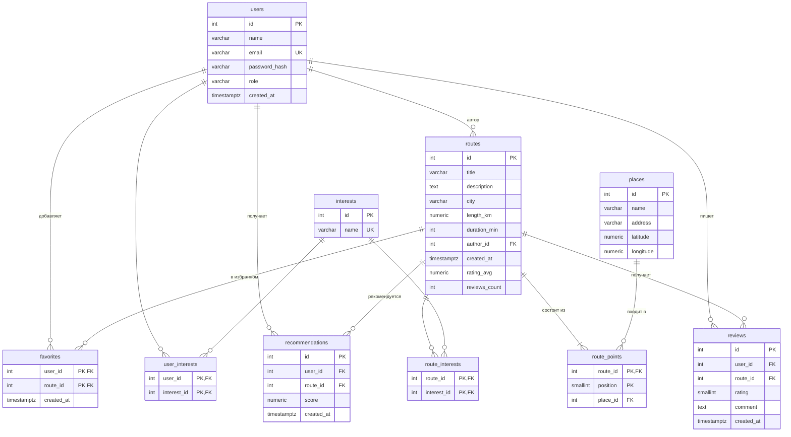

# Практическое занятие №3. Проектирование базы данных

**Проект:** Система рекомендаций городских маршрутов
**Студент:** Ватаншоев Артур Бахтоваршоевич, ЭФБО-08-24
**СУБД:** PostgreSQL

Файлы:
- [`schema.sql`](schema.sql) — создание таблиц, ограничений, индексов и триггера;
- [`examples.sql`](examples.sql) — тестовые данные и примеры запросов.

Запуск: `psql -d <имя_бд> -f schema.sql -f examples.sql`

---

## 1. Сущности, атрибуты и связи

| Сущность | Таблица | Назначение |
|---|---|---|
| Пользователь | `users` | Зарегистрированный пользователь или администратор |
| Интерес | `interests` | Справочник интересов (история, парки, кафе…) |
| Маршрут | `routes` | Городской маршрут с описанием, длиной и временем |
| Место | `places` | Точка на карте (достопримечательность, парк, кафе) |
| Точка маршрута | `route_points` | Место в составе маршрута с порядковым номером |
| Отзыв | `reviews` | Оценка и комментарий пользователя к маршруту |
| Рекомендация | `recommendations` | Маршрут, подобранный пользователю, с оценкой релевантности |
| Избранное | `favorites` | Маршруты, сохранённые пользователем |
| — | `user_interests`, `route_interests` | Связки M:N пользователей и маршрутов с интересами |

**Связи:**
- `users` M:N `interests` — через `user_interests`;
- `routes` M:N `interests` — через `route_interests`;
- `routes` M:N `places` — через `route_points` (с порядком `position`);
- `users` 1:N `routes` — пользователь является автором маршрутов;
- `users` 1:N `reviews`, `routes` 1:N `reviews`;
- `users` 1:N `recommendations`, `routes` 1:N `recommendations`;
- `users` M:N `routes` — через `favorites`.

Связь M:N в реляционной БД напрямую не хранится, поэтому для неё создаётся промежуточная таблица из двух внешних ключей.

## 2. ER-диаграмма и ключи



Обозначения: `||--o{` — «один ко многим (0..N)», `||--|{` — «один ко многим (1..N)»: маршрут состоит минимум из одной точки.

### Ключи

| Таблица | PK | FK | UNIQUE |
|---|---|---|---|
| users | id | — | email |
| interests | id | — | name |
| routes | id | author_id → users | — |
| places | id | — | — |
| route_points | (route_id, position) | route_id → routes, place_id → places | — |
| user_interests | (user_id, interest_id) | user_id → users, interest_id → interests | — |
| route_interests | (route_id, interest_id) | route_id → routes, interest_id → interests | — |
| recommendations | id | user_id → users, route_id → routes | — |
| reviews | id | user_id → users, route_id → routes | (user_id, route_id) |
| favorites | (user_id, route_id) | user_id → users, route_id → routes | — |

**Обоснование:**
- **Суррогатный `id`** у основных сущностей: не меняется (в отличие от email), компактен, удобен для внешних ключей.
- **Составной PK у связок M:N**: пара значений уникальна сама по себе, это запрещает дубли (один интерес дважды у одного пользователя). Отдельный `id` не нужен.
- **`route_points` — PK (route_id, position)**, а не (route_id, place_id): в кольцевом маршруте одно место может быть и стартом, и финишем, а номер позиции внутри маршрута уникален всегда.
- **`reviews` — `id` + UNIQUE (user_id, route_id)**: один отзыв пользователя на маршрут; `id` удобен для ссылок (редактирование, модерация).
- **`recommendations` — `id` без UNIQUE**: один маршрут может рекомендоваться пользователю повторно, сохраняется история.

## 3. Типы данных и ограничения

### Выбор типов

| Тип | Где | Почему |
|---|---|---|
| `INT GENERATED ALWAYS AS IDENTITY` | все `id` | Автоинкремент по стандарту SQL; запрещает ручную вставку `id` |
| `VARCHAR(n)` | имена, email, title, city | Короткие строки с разумным ограничением длины |
| `TEXT` | description, comment | Текст произвольной длины |
| `NUMERIC(9,6)` | latitude, longitude | Точность до ~10 см, без ошибок округления, как у `FLOAT` |
| `NUMERIC(6,2)` | length_km | Точное десятичное значение (до 9999.99 км) |
| `SMALLINT` | rating, position | Малые числа (1–5, номер точки), экономия места |
| `NUMERIC(4,3)` | score | Релевантность в диапазоне 0.000–1.000 |
| `TIMESTAMPTZ` | created_at | Дата и время с часовым поясом — корректно при пользователях из разных городов |

### Ограничения целостности

| Ограничение | Пример | Что гарантирует |
|---|---|---|
| `NOT NULL` | `routes.title`, `users.email` | Обязательные поля заполнены |
| `UNIQUE` | `users.email`, `interests.name` | Нет двух аккаунтов на один email, нет дублей интересов |
| `CHECK` | `rating BETWEEN 1 AND 5`, `length_km > 0`, `role IN ('user','admin')`, диапазоны координат | Недопустимые значения не попадут в БД даже при ошибке в коде приложения |
| `DEFAULT` | `created_at DEFAULT now()`, `role DEFAULT 'user'` | Значение подставляется автоматически |
| `FOREIGN KEY` | `reviews.route_id → routes.id` | Нельзя сослаться на несуществующую запись |

### Поведение внешних ключей при удалении

| Правило | Где | Смысл |
|---|---|---|
| `ON DELETE CASCADE` | связки, отзывы, рекомендации, избранное, точки маршрута | Удалили пользователя/маршрут — удаляются и зависимые записи |
| `ON DELETE SET NULL` | `routes.author_id` | Удаление автора не удаляет его маршруты — они полезны другим |
| `ON DELETE RESTRICT` | `route_points.place_id` | Нельзя удалить место, пока оно входит в маршрут — иначе маршрут «сломается» |

## 4. Оптимизация

### 4.1. Индексы

PostgreSQL автоматически создаёт индексы только для PK и UNIQUE. Индексы на внешние ключи нужно создавать самостоятельно — под реальные запросы:

| Индекс | Запрос, который ускоряет |
|---|---|
| `routes (city)` | Поиск маршрутов по городу — главный сценарий |
| `routes (author_id)` | «Мои маршруты» |
| `route_interests (interest_id)` | Подбор маршрутов по интересам — основа рекомендаций |
| `user_interests (interest_id)` | Поиск пользователей с заданным интересом |
| `route_points (place_id)` | В каких маршрутах есть место (проверка перед удалением места) |
| `reviews (route_id, created_at DESC)` | Отзывы маршрута, новые сверху — один индекс для фильтра и сортировки |
| `recommendations (user_id, created_at DESC)` | Последние рекомендации пользователя |
| `recommendations (route_id)`, `favorites (route_id)` | Каскадное удаление маршрута и подсчёт «в избранном» |

**Почему не индексировать всё подряд:** каждый индекс занимает место и замедляет `INSERT/UPDATE/DELETE`, так как его нужно обновлять. Индексы, у которых первый столбец уже совпадает с PK или UNIQUE, не дублируются: например, `user_interests (user_id)` покрывается PK `(user_id, interest_id)`.

**Проверка:** `EXPLAIN SELECT * FROM routes WHERE city = 'Москва';` показывает `Index Scan using idx_routes_city` — запрос использует индекс, а не перебирает всю таблицу (`Seq Scan`). На очень маленьких таблицах планировщик может выбрать `Seq Scan`, так как это дешевле.

### 4.2. Агрегаты

Средний рейтинг маршрута показывается в каждом списке маршрутов. Считать `AVG(rating)` по таблице `reviews` при каждом запросе дорого, поэтому в `routes` хранятся готовые значения `rating_avg` и `reviews_count`. Их автоматически пересчитывает триггер `trg_reviews_rating` при добавлении, изменении и удалении отзыва (см. `schema.sql`, раздел 5).

### 4.3. Кэширование

- **Таблица `recommendations`** сама является кэшем: алгоритм подбора запускается не на каждый запрос страницы, а периодически или после изменения интересов, а результат сохраняется.
- **Кэш приложения (Redis)** для часто читаемых и редко меняющихся данных: список интересов, популярные маршруты города, карточка маршрута с точками. Время жизни — 5–15 минут; при изменении маршрута ключ удаляется.
- **Пул соединений** (например, в SQLAlchemy/Django): соединения с БД переиспользуются, а не открываются на каждый запрос.

## 5. Нормализация и денормализация

### Нормализация

| Нормальная форма | Требование | Как выполнено |
|---|---|---|
| **1НФ** | Атомарные значения, нет повторяющихся групп | Интересы — не строка `"парки, музеи"`, а отдельная таблица `interests` + связки. Точки маршрута — отдельные строки `route_points`, а не список в поле |
| **2НФ** | 1НФ + неключевые атрибуты зависят от **всего** составного ключа | В `route_points` атрибут `place_id` зависит от пары (route_id, position); в `favorites` `created_at` — от пары (user_id, route_id). Данные о месте (name, address) вынесены в `places`, а не повторяются в `route_points` |
| **3НФ** | 2НФ + нет транзитивных зависимостей (неключевой атрибут зависит от другого неключевого) | Данные автора не копируются в `routes` — хранится только `author_id`; данные маршрута не копируются в `reviews` — только `route_id` |

Выигрыш нормализации: каждое значение хранится в одном месте, нет аномалий обновления (переименовали место — изменение видно во всех маршрутах).

**Сознательное допущение:** `routes.city` хранится строкой. Для MVP с небольшим числом городов это проще; при росте проекта город выносится в справочник `cities` (защита от разных написаний «Москва» / «москва»).

### Денормализация

| Поле | Почему денормализовано | Как поддерживается согласованность |
|---|---|---|
| `routes.rating_avg`, `routes.reviews_count` | Вычисляются из `reviews`, но нужны при каждом показе списка маршрутов | Триггер пересчитывает при каждом изменении отзывов |
| `routes.length_km`, `routes.duration_min` | Хранятся, а не вычисляются по координатам точек: реальный пешеходный путь не равен прямой между точками, время зависит от остановок | Задаются автором или сервисом построения маршрута |

Денормализация — компромисс: чтение становится быстрее, но запись немного медленнее, и нужен механизм синхронизации (здесь — триггер).

## 6. Безопасность

| Угроза | Мера защиты |
|---|---|
| Утечка паролей | Хранится только `password_hash` (bcrypt/argon2 с солью), сам пароль в БД никогда не записывается |
| SQL-инъекции | Только параметризованные запросы или ORM (`cursor.execute("... WHERE email = %s", (email,))`), никакой склейки строк с вводом пользователя |
| Избыточные права приложения | Отдельная роль БД для приложения с минимальными правами (см. ниже) |
| Повышение привилегий | Роль пользователя проверяется на сервере; `CHECK (role IN ('user','admin'))` не даёт записать произвольную роль |
| Некорректные данные | Ограничения `CHECK`, `NOT NULL`, `FOREIGN KEY` на уровне БД |
| Перехват трафика | Подключение к БД по SSL/TLS, БД недоступна из интернета напрямую |
| Потеря данных | Регулярное резервное копирование (`pg_dump`), проверка восстановления |
| Персональные данные (152-ФЗ) | Минимум личных данных (имя, email); доступ к ним только у приложения и администратора |

**Принцип минимальных привилегий** — приложение не может менять структуру БД:

```sql
CREATE ROLE city_routes_app LOGIN PASSWORD '***';
GRANT SELECT, INSERT, UPDATE, DELETE ON ALL TABLES IN SCHEMA public TO city_routes_app;
-- нет прав на CREATE / DROP / ALTER: даже при взломе приложения таблицы не удалить
```

Миграции схемы выполняются отдельной ролью-владельцем, а не ролью приложения.

## 7. Итог

Спроектирована БД из 10 таблиц в 3НФ, с целенаправленной денормализацией рейтинга. Целостность обеспечивается ключами и ограничениями на уровне СУБД, производительность — индексами под основные сценарии, агрегатами и кэшированием, безопасность — хэшированием паролей, параметризованными запросами и минимальными правами. Схема проверена в PostgreSQL 18: `schema.sql` и `examples.sql` выполняются без ошибок, триггер корректно пересчитывает рейтинг, поиск по городу использует индекс.
